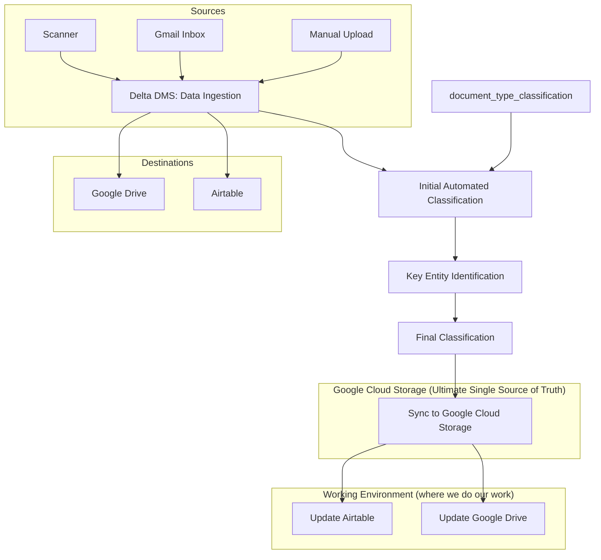

# Document Classification Decision Tree

## Overview

This document outlines a proposed decision tree for document classification. The tree will be used to classify documents into one of several categories based on their content and metadata. High level document movement:

## 0. Document Type Classification Decision Tree

### Definitions
- Document Purpose
    - Product documents: PROD
    - Registration documents: REG
    - Communication documents: COM
    - Reporting documents: REP
- Document Base Type
    - Information: INFO
    - Application: APP
    - Certificate: CERT
    - Submission: SUB
    - Tonnage Report: TON
- Document Sub-Type 
    - PROD
        - Product Label: PROD_LABEL
        - SDS: PROD_SDS
        - Efficacy: PROD_EFF
        - Tonnage Report: PROD_TON
    - REG
        - Registration Application: REG_APP
        - Registration Renewal Application: REG_APP_RENEW
        - Registration Application Submission: REG_APP_SUB
        - Registration Certificate: REG_CERT
        - Registration Rejection: REG_APP_REJECTION
    - COM
        - Communication: COM_INFO
        - Email: COM_EMAIL
        - Letter: COM_LETTER
        - Memo: COM_MEMO
        - Report: COM_REPORT
        - Other: COM_OTHER
    - REP
        - Tonnage Report: REP_TON

* NOTE: document sub-type is more granular to each base type. put it all together to get the full document type. *

### Explanations
This entire document management system is to support the registration process. Every document has a purpose in that process:
- **Product Documents**: aka "PROD" is the core entity is the product itself. it is primarily used during the new registration application process, new or renewal. document_sub_types of product_document are:
    - **Product Label**: a label for a product
    - **SDS**: a safety data sheet for a product
    - **Efficacy**: a document that shows the efficacy of a product
    - NOTE: **add more as needed ...**

- **Registration Documents**: aka "REG" these documents are related to the registration process. applying for a new registration, or renewing an existing registration, or approval of a product registration. document_sub_types of regulatory_document are:
    - **Registration Application** aka REG_APP: a document that is used to apply for a new or renewal registration
    - **Registration New Application** aka REG_APP_NEW: a new registration application. this is the form that is used to apply for a new registration. it will usually have instructions on how to fill it out, dictate an application fee, if any, tell you what documents to include, where to send it, etc.
    - **Registration Renewal Application** aka REG_APP_RENEW: an application to renew an existing registration. this is the form that is used to renew an existing registration. it will usually have instructions on how to fill it out, dictate an application fee, if any, tell you what documents to include, etc.
    - **Registration Application Submission** aka REG_APP_SUB: a registration application submission document is a compiled Registration Application that is used to submit a registration application
    - **Registration Certificate** aka REG_CERT: a document that is issued by a regulator to certify a product registration. it will have a unique identifier, and a date of issuance and usually a date of expiration. It might be a license, certificate, permit, etc. It might grant registration to multiple products, or a single product. It might be a temporary registration, or a permanent registration. It might be a registration for a specific use, or a registration for all uses. Ideally, we will capture all of this information in the metadata.

### Registration Cycle
- Product Documents: Gather product documents from the client.
- New Registration or Renewal Registration:
    - Product Documents: Regulator requirements dictate the required supporting product documents for the new or renewal registration application submission: 
        - Product Label
        - SDS
        - Efficacy
        - Check/Payment
        - etc
    - Registration Application: Fill out the registration application.
    - Registration Submission: Submit the registration application with included product documents and payment.
    - Registration Certificate: Receive the registration certificate.

- Certificate:
    - These come in the form of a certificate, license, permit, etc. Certificates represent Regulator approval of the registration application. Next comes the Reporting Period.

- Reporting Period:
    - Tonnage Report:
        - Depending on the product type and Regulator requirements: Fertilizer, Pesticide, soil ammendment, liming, adjuvant etc., tonnage reports may be required annually, semi-annually, quarterly, monthly, etc.
        - Tonnage Report: Fill out the tonnage report per Regulator's requirements, for the specified reporting period.
        - Tonnage Report Submission: Submit the tonnage report, scanned and uploaded to the DMS with a check/payment.

- Action Needed:
    - sometimes a Registration may not be accepted due to factors. if an intervention is needed, the document will be moved to the action needed folder. here are some reasons why:
        - Product Documents are missing
        - Registration Application has missing or incorrect information
        - A label needs revision
        - Reporting Period is not met
        - Payment is not received
        - etc

### Decision Tree (WORK IN PROGRESS)
- If it is a product document, then there may not be a relevent regulator. the product is the core entity.
    - we need to identify: 
        - the product name
        - the client name that owns the product
        - product document sub_type: label, sds, efficacy, tonnage report
        - product_document_type: PROD_LABEL, PROD_SDS, PROD_EFF, PROD_SDS

- Else, if it is not a product document, we need to identify:
    - document purpose: (e.g. registration, registration renewal, etc.)
    - the document type: (e.g. registration application, registration renewal, etc.)
    - the client name
    - the regulator name

- If it is a registration document, then we need to identify:
    - is it an application?
        - is it blank?

        - is it a new application?
        - is it a renewal?
        - is it a submission?
        - is it a rejection?
    - is it a certificate?
    - is it a tonnage report?
    

## 1. Data Ingestion

- **Source:**
  - Scanner (Snail Mail)
  - Gmail Inbox (Email)
  - Manual Upload (Paperless-NGX / Delta DMS)

## 2. Initial Automated Classification (Delta DMS)

- **Delta DMS NLP Model attempts to classify:**
  - **Document Type (Highest Priority)**
    - *If correctly classified, DMS applies associated custom metadata fields.*
    - Example: "Certificate" -> Effective Date, Expiration Date
    - Example: "Tonnage Report" -> Reporting Period
  - **Correspondent**
    - usually a Regulatory Agency: Arizona Department of Agriculture, Maine Department of Agriculture, etc.
  - **Title/Filename**
    - this one is usually easy for the llm
  - **Tags**
    - see below

### Tags
- The system utilizes several categories of tags:
    - **Special Purpose Tags:** Used for workflow management and status tracking (e.g., `INBOX`, `ai-todo`, `ai-done`, `confidential`, `payment`).
        - `INBOX`: Document is in the inbox 
        - `ai-todo`: Document is waiting for AI processing
        - `ai-OCR-todo`: Document is waiting for OCR processing
        - `ai-done`: Document is done with AI processing
        - `confidential`: Document is confidential
        - `payment`: Document is a payment
        - `OCR-done`: Document is done with OCR processing

    - **Client Tags:** Identify the client associated with the document (e.g., `Clients/ARB`, `Clients/BIN`). These are crucial for organizing and retrieving client-specific information. If the document type is Product related, the client tag can correlate with the `Correspondent` field.
        - `Clients/ARB` -> Arborjet
        - `Clients/BIN` -> Bio Insumos Nativa
        - `Clients/BOR` -> Borax
        - `Clients/ECO` -> Ecologel
        - `Clients/EEA` -> Elemental Enzymes
        - `Clients/GWB` -> Groundwork Bioag
        - `Clients/IBA` -> Indogulf Bioag
        - `Clients/OMY` -> Omya
        - `Clients/PLL` -> Precision Laboratories
        - `Clients/SAG` -> Solstice Agriculture
        - `Clients/SEI` -> Seipasa
        - `Clients/SYM` -> Symborg

    - **Regulator Tags:** Identify the regulatory body related to the document (e.g., `Regulators/AZ`, `Regulators/CA`). These often correlate with the `Correspondent` field.
        - `Regulators/AZ` -> Arizona Department of Agriculture
        - `Regulators/CA` -> California Department of Food and Agriculture
        - `Regulators/CT` -> Connecticut Department of Agriculture
        - `Regulators/IL` -> Illinois Department of Agriculture
        - `Regulators/IN` -> Indiana Office of Indiana State Chemist
        - `Regulators/KS` -> Kansas Department of Agriculture
        - `Regulators/KY` -> Kentucky Division of Regulatory Services
        - `Regulators/MA` -> Massachusetts Department of Agriculture
        - `Regulators/ME` -> Maine Department of Agriculture
        - `Regulators/NH` -> New Hampshire Department of Agriculture
        - `Regulators/WA` -> Washington State Department of Agriculture

    - **Product Tags:** Specify product information if applicable (e.g., `Product/CofA`, `Product/CSF`).
        - `Type/Product_CofA`: Certificate of Analysis
        - `Type/Product_CSF`: Certificate of Statement of Formulation
        - `Type/Product_label`: Product Label
        - `Type/Product_labs`: Product Labs

    - **Document Type Tags:** Identify the document type:
        - `Type/REG_APP`: Registration Application
        - `Type/REG_APP_NEW`: New Registration Application
        - `Type/REG_APP_RENEW`: Registration Renewal Application
        - `Type/REG_APP_SUB`: Registration Application Submission
        - `Type/REG_CERT`: Registration Certificate
        - `Type/REP_TON`: Tonnage Report

## 3. Key Entity Identification (Post Document Type Assignment)

- **Client Identification:**
  - Applied as Tag: `Clients/[client_code]`
  - Example: `Clients/ARB` (Arborjet)
- **Regulator Identification:**
  - Applied as Tag: `Regulators/[state_code]`
  - Example: `Regulators/AZ` (Arizona Department of Agriculture)
  - Often maps to Correspondent (e.g., AZ-DOA)

